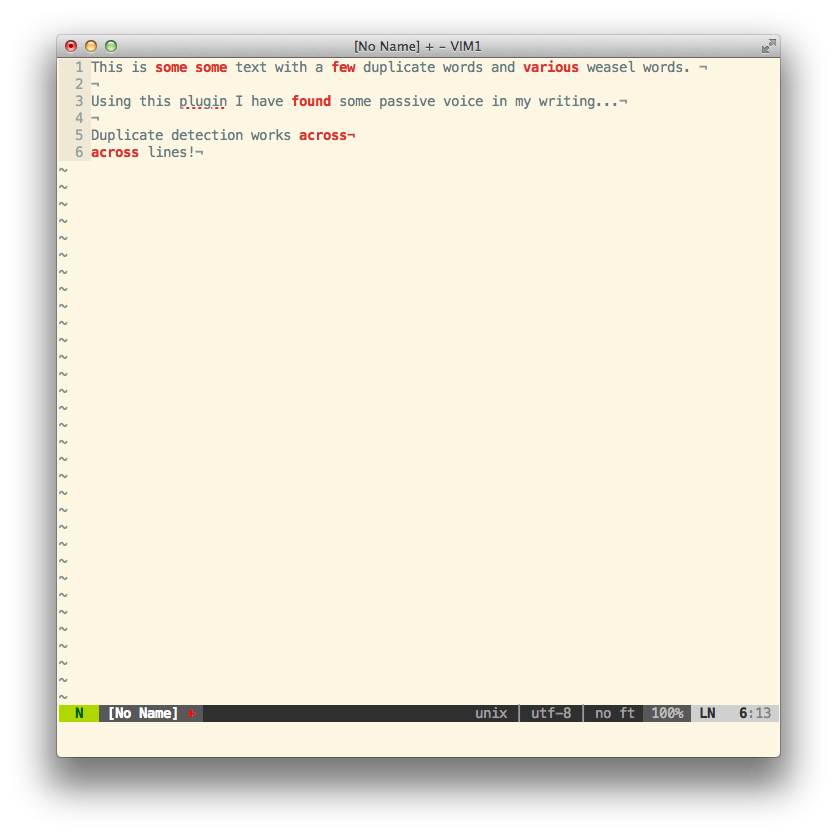

# Writegood.vim

Writegood is a plugin to highlight common writing problems.

The plugin uses the `Error` group to highlight errors, so I assume it will work
on both gvim and terminal vim.

## Features
* Detects duplicate words (even over newlines)
* Highlights use of passive voice
* Highlights common "weasel words" 

## Screenshot

## About

After reading Matt Might's blog post about a year ago, I was thrilled when I
came across Benjamin Beckwith's writegood mode for Emacs, my editor of choice at
the time. However, people change, and after jumping on the vim bandwagon about
six months ago I forgot about both the plugin and Matt's post.

Eventually I found myself in the position to be doing some academic writing
again, and was frustrutated when I couldn't find a similar plugin for vim, so
after reading Steve Losh's 'Learn Vimscript the Hard Way' I decided to write one
for myself.

### Links
* Matt Might's original [blog post](http://matt.might.net/articles/shell-scripts-for-passive-voice-weasel-words-duplicates/)
* Benjamin Beckwiths [emacs minor-mode](https://github.com/bnbeckwith/writegood-mode)
* Steve Losh's [Learn Vimscript the Hard Way](http://learnvimscriptthehardway.stevelosh.com/)
* Nate Kane's [vim-indent-guides](https://github.com/nathanaelkane/vim-indent-guides)

### Credits
* Matt Might for writing the original scripts.
* Benjamin Beckwith for the emacs mode and catchy title I've borrowed.
* Steve Losh for 'Learn Vimscript the Hard Way'.
* Nathaniel Kane for the vim-indent-guides plugin, which I used as a
    reference for structuring and documentation.
    
### Contact  
* Twitter: @dabeckingsale

If anyone has any suggestions for improving my dodgy match usage, it would be
much appreciated.                                                             
